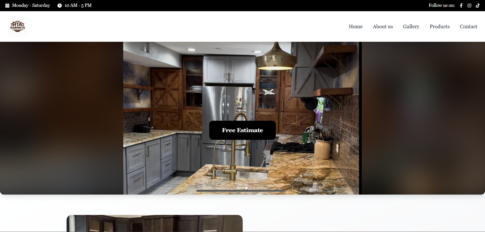
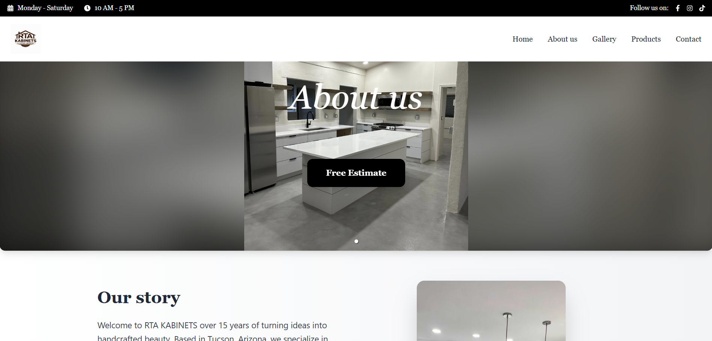
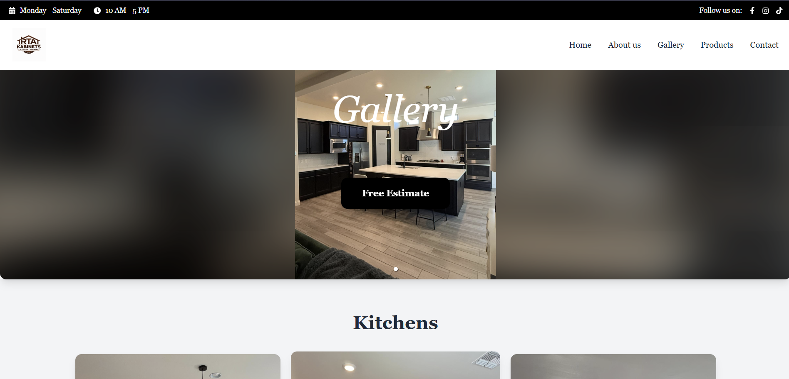
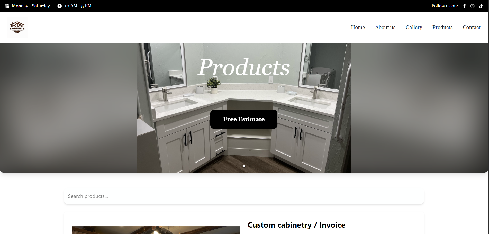
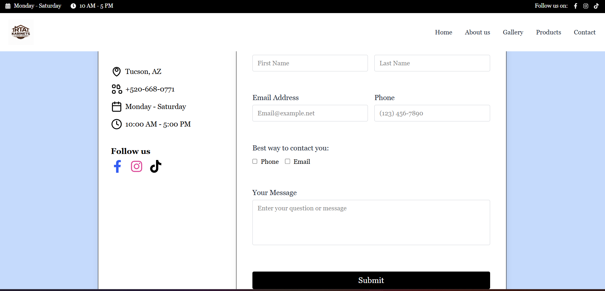
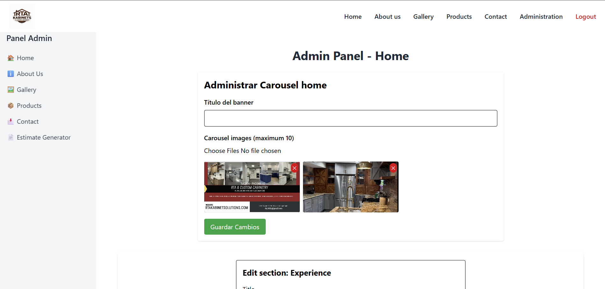

# RTA Kabinets Solutions - Caso de estudio

Caso de estudio de una plataforma web desarrollada para RTA Kabinets Solutions, un negocio de carpintería y remodelación ubicado en Tucson, Arizona.

El proyecto fue creado para presentar servicios, mostrar productos, enseñar trabajos realizados, recibir solicitudes de contacto y apoyar la generación de estimaciones mediante un panel administrativo.

## Sitio web

El proyecto se encuentra desplegado y puede visitarse aquí:

🔗 https://rtakabinetsolutions.com/

## Descripción del proyecto

Esta plataforma web fue desarrollada para apoyar la presencia digital del negocio y mejorar parte de su proceso interno de administración. El sitio cuenta con secciones públicas para visitantes y un área administrativa utilizada para gestionar contenido e información relacionada con estimaciones.

## Tecnologías utilizadas

- React
- Node.js
- MySQL
- JavaScript
- HTML
- CSS
- Dokploy
- Hostinger

## Funcionalidades principales

- Diseño web responsive
- Página principal con carrusel de imágenes
- Sección About Us
- Galería de trabajos realizados
- Sección de productos
- Formulario de contacto
- Panel administrativo
- Administración de contenido del sitio
- Apoyo para la generación de estimaciones para clientes

## Capturas del proyecto

### Página principal

### About Us

### Galería

### Productos

### Contacto

### Panel administrativo

## Mi participación

Participé en el desarrollo y configuración de la plataforma web, trabajando en la interfaz, integración con backend, uso de base de datos, funcionalidades administrativas, despliegue y mejoras con base en las necesidades del negocio.

## Nota

El código fuente de este proyecto no es público porque corresponde a un proyecto real de cliente. Este repositorio se utiliza como caso de estudio para mostrar la estructura general del proyecto, sus funcionalidades principales, capturas de pantalla y resultado final.

## Estado del proyecto

Desplegado y en uso.

